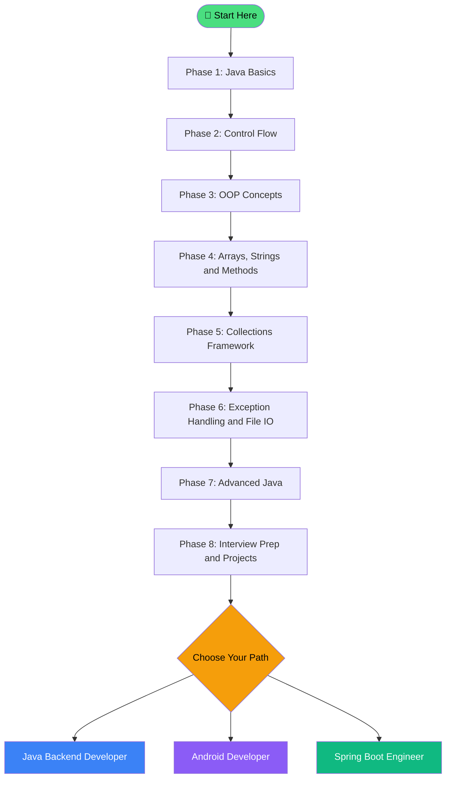

# Welcome to the Coding Life Java Course!

> 🚀 **You're in the right place.** Whether you've never written a single line of code or you just want to get really good at Java — this course is built for **you**.

---

## What Is This Course?

This is a **complete, free Java course** that takes you from absolute zero to a professional-level Java developer — step by step, lesson by lesson.

No fluff. No confusion. Just clear explanations, real code, and honest interview prep.

By the time you finish, you'll be able to:
- Build real Java applications from scratch
- Understand how Java actually works under the hood
- Crack Java interview questions confidently
- Start a career as a Java backend developer, Android developer, or Spring Boot engineer

---

## Who Is This Course For?

| You Are... | Is This For You? |
|---|---|
| 🎓 A school or college student | ✅ Absolutely — start from Lesson 1 |
| 👶 A complete beginner to programming | ✅ Yes — no experience needed |
| 💼 Someone switching careers to tech | ✅ Yes — follow the full roadmap |
| 💻 A developer who knows another language | ✅ Yes — skip basics, jump to OOP |
| 🎯 Preparing for Java interviews | ✅ Yes — every lesson has interview Q&As |

---

## Course Overview

The course is organized into **8 phases**, going from the very basics all the way to advanced professional skills.

| Phase | Topic | Lessons | Difficulty |
|---|---|---|---|
| 🟢 Phase 1 | Java Basics — Syntax, Variables, Data Types | ~12 lessons | Beginner |
| 🟢 Phase 2 | Control Flow — If/Else, Loops, Switch | ~10 lessons | Beginner |
| 🟡 Phase 3 | Object-Oriented Programming (OOP) | ~15 lessons | Intermediate |
| 🟡 Phase 4 | Arrays, Strings & Methods | ~10 lessons | Intermediate |
| 🟠 Phase 5 | Collections Framework | ~10 lessons | Intermediate |
| 🟠 Phase 6 | Exception Handling & File I/O | ~8 lessons | Intermediate |
| 🔴 Phase 7 | Advanced Java — Generics, Lambdas, Streams | ~10 lessons | Advanced |
| 🔴 Phase 8 | Interview Prep & Real Projects | ~8 lessons | Advanced |

> 💡 **Total:** 80+ lessons covering everything from `Hello World` to production-ready Java code.

---

## Learning Path Flowchart

---

## How to Use This Course

Follow these simple rules to get the most out of every lesson:

1. **Go in order** — Each lesson builds on the previous one. Do not skip phases.
2. **Type the code yourself** — Copy-pasting won't make you learn. Actually type it.
3. **Read the "Common Mistakes" section** — This saves you hours of debugging.
4. **Try the interview questions** — Answer them out loud before reading the answer.
5. **Revisit the Quick Revision** — Re-read the checkmark bullet points at the end of each lesson after 1–2 days.
6. **Don't rush** — Understanding beats speed every time.

---

## Quick Start

Ready to write your first Java program?

👉 **[Go to Lesson 1: Introduction to Java 🚀](/docs/java/fundamentals/what-is-java)**

Or check the full roadmap first:

👉 **[View the Java Learning Roadmap 🗺️](/docs/java-roadmap)**

---

## Tips for Success

- **Consistency beats intensity.** 30 minutes every day beats 5 hours once a week.
- **It's okay to be confused.** Confusion means you're learning. Keep going.
- **Google is your friend.** Every professional Java developer searches things online.
- **Break things.** Modify the code examples and see what happens. That's how you truly learn.
- **Celebrate small wins.** Got your first loop to work? That's real progress. 🎉🎉

---

> 💬 *"The best time to start learning Java was yesterday. The second best time is right now."*

**Let's go! 🚀🚀**

