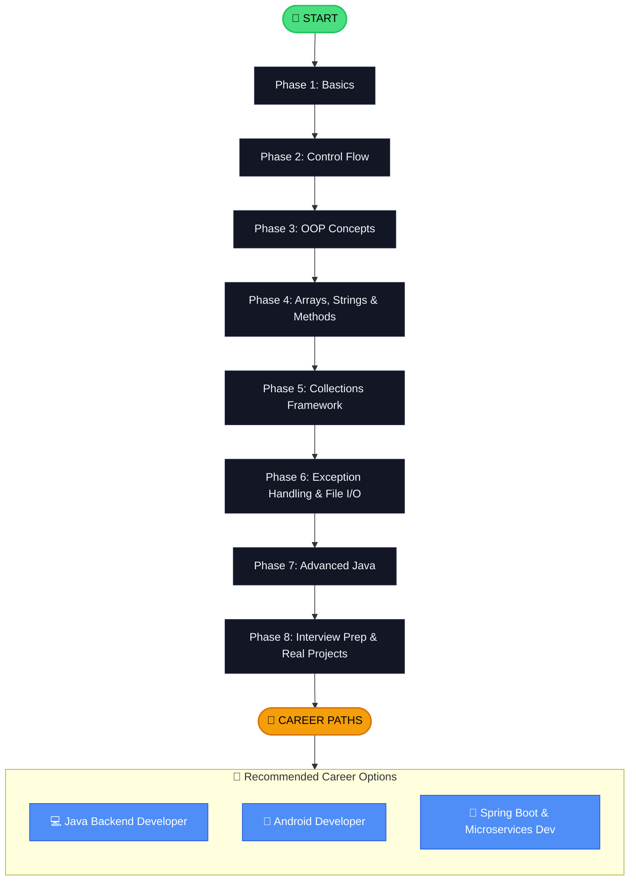

# Java Learning Roadmap

> Your complete visual guide from **zero** to **professional Java developer** — phase by phase, skill by skill.

---

## The Big Picture

---

## Phase 1 — Java Basics

**⏱️ Estimated Time:** 2–3 weeks (2 hrs/day)

- What is Java? History & Features
- Setting Up JDK & IDE (IntelliJ / VS Code)
- Your First Program — Hello World
- Variables & Data Types (int, double, String, boolean)
- Type Casting (implicit & explicit)
- Operators (Arithmetic, Relational, Logical, Bitwise)
- Input & Output (Scanner, System.out)
- Comments & Code Style
- Constants (final keyword)
- How Java Code Compiles and Runs (JVM, JRE, JDK)

**🎯 Skills gained after Phase 1:**
- Write and run basic Java programs
- Understand variables, types, and operators
- Take input from the user and display output

---

## Phase 2 — Control Flow

**⏱️ Estimated Time:** 2 weeks (2 hrs/day)

- if / else if / else Statements
- Nested if Statements
- Switch Statement (classic & enhanced)
- for Loop
- while Loop
- do-while Loop
- break and continue
- Nested Loops
- Practice Problems — Patterns, Number Logic

**🎯 Skills gained after Phase 2:**
- Control the flow of your programs using conditions
- Write loops to repeat actions
- Solve basic logic problems in Java

---

## Phase 3 — Object-Oriented Programming (OOP)

**⏱️ Estimated Time:** 3–4 weeks (2 hrs/day)

- What is OOP? (Real-world analogy)
- Classes & Objects
- Constructors (default, parameterized, copy)
- this Keyword
- Encapsulation (private fields + getters/setters)
- Inheritance (extends keyword)
- Method Overriding (@Override)
- Polymorphism (compile-time & runtime)
- Abstraction (abstract classes)
- Interfaces
- static Keyword
- final Keyword
- instanceof Operator

**🎯 Skills gained after Phase 3:**
- Think in terms of objects and classes
- Apply the 4 pillars of OOP (Encapsulation, Inheritance, Polymorphism, Abstraction)
- Design basic object-oriented programs

---

## Phase 4 — Arrays, Strings & Methods

**⏱️ Estimated Time:** 2 weeks (2 hrs/day)

- Arrays (1D and 2D)
- Array Methods (sort, copy, fill)
- Enhanced for Loop (for-each)
- String class & String methods
- StringBuilder & StringBuffer
- String Pool & Immutability
- Method Overloading
- Varargs (variable arguments)
- Recursion basics
- Math class & utility methods

**🎯 Skills gained after Phase 4:**
- Work with arrays and manipulate data
- Use all important String methods confidently
- Write reusable methods

---

## Phase 5 — Collections Framework

**⏱️ Estimated Time:** 2–3 weeks (2 hrs/day)

- What is the Collections Framework?
- List interface --> ArrayList, LinkedList
- Set interface --> HashSet, LinkedHashSet, TreeSet
- Map interface --> HashMap, LinkedHashMap, TreeMap
- Queue & Deque --> PriorityQueue, ArrayDeque
- Iterators & ListIterators
- Collections utility class
- Comparable vs Comparator
- When to use which Collection

**🎯 Skills gained after Phase 5:**
- Store and manage groups of data efficiently
- Choose the right data structure for the right problem
- Sort and search collections

---

## Phase 6 — Exception Handling & File I/O

**⏱️ Estimated Time:** 1–2 weeks (2 hrs/day)

- What is an Exception?
- try / catch / finally
- throws & throw keywords
- Checked vs Unchecked Exceptions
- Custom Exceptions
- Multi-catch blocks
- File I/O — FileReader, FileWriter
- BufferedReader & BufferedWriter
- try-with-resources

**🎯 Skills gained after Phase 6:**
- Write programs that handle errors gracefully
- Read and write files in Java
- Create custom exception types

---

## Phase 7 — Advanced Java

**⏱️ Estimated Time:** 3 weeks (2 hrs/day)

- Generics (Generic classes & methods)
- Functional Interfaces
- Lambda Expressions
- Stream API (filter, map, reduce, collect)
- Optional class
- Method References
- Date & Time API (java.time)
- Multithreading basics (Thread, Runnable)
- Synchronization
- Java 8–17 key features overview

**🎯 Skills gained after Phase 7:**
- Write modern, functional-style Java code
- Process data using the Streams API
- Understand multithreading and concurrency basics

---

## Phase 8 — Interview Prep & Real Projects

**⏱️ Estimated Time:** 2–3 weeks (2 hrs/day)

- Top 100 Java Interview Questions
- Data Structures in Java (Stack, Queue, Tree, Graph)
- Sorting Algorithms (Bubble, Merge, Quick)
- Design Patterns (Singleton, Factory, Builder)
- SOLID Principles
- Project 1 — Student Management System
- Project 2 — Bank Account Manager
- Project 3 — Library Management System

**🎯 Skills gained after Phase 8:**
- Confidently answer Java interview questions
- Implement classic data structures
- Build real-world Java applications

---

## Recommended Learning Timeline

| Schedule | Estimated Completion |
|---|---|
| 1 hour/day | ~12 months |
| 2 hours/day | ~6 months |
| 3 hours/day | ~4 months |
| 5+ hours/day (full time) | ~2–3 months |

> 💡 **Best approach:**** 2 hours/day consistently = 6 months to professional level.

---

## Tools to Install

Set up your environment before you start coding:

| Tool | Purpose | Download |
|---|---|---|
| **JDK 17+** | Java Development Kit — required to run Java | [oracle.com/java](https://www.oracle.com/java/technologies/downloads/) |
| **IntelliJ IDEA** (Community) | Best free Java IDE | [jetbrains.com/idea](https://www.jetbrains.com/idea/) |
| **VS Code** | Lightweight alternative IDE | [code.visualstudio.com](https://code.visualstudio.com/) |
| **Git** | Version control — track your code changes | [git-scm.com](https://git-scm.com/) |
| **Postman** | Test APIs (needed in Phase 8) | [postman.com](https://www.postman.com/) |
| **MySQL** | Database (needed for projects) | [mysql.com](https://www.mysql.com/) |

---

## Career Paths After Completion

### Java Backend Developer
- **What you'll do:** Build server-side APIs and business logic
- **Key skills:** Core Java, Spring Boot, REST APIs, Databases
- **Next steps after this course:** Learn Spring Boot, Hibernate, REST API design

### Android Developer
- **What you'll do:** Build mobile apps for Android devices
- **Key skills:** Java (or Kotlin), Android SDK, XML layouts
- **Next steps after this course:** Learn Android Studio, Activities, Fragments

### Spring Boot / Microservices Developer
- **What you'll do:** Build scalable cloud-native applications
- **Key skills:** Spring Boot, Docker, REST, Microservices
- **Next steps after this course:** Learn Spring Boot, Docker, Kubernetes basics

---

## How to Know You're Ready for a Job

You're job-ready when you can:
- [ ] Explain OOP concepts with real examples
- [ ] Write Java code without looking up basic syntax
- [ ] Build a CRUD application from scratch
- [ ] Answer the top 50 Java interview questions
- [ ] Push your code to GitHub
- [ ] Explain your project in an interview

---

> 💡 **Start with Phase 1 and work your way through. Every expert was once a beginner.**

👉 **[Start Learning Now 🚀](/docs/java/fundamentals/what-is-java)**

